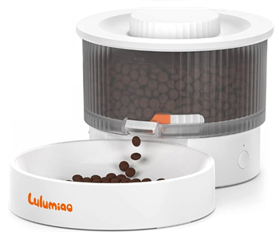

# asf02

Lulumiao pet slow feeders can only be managed via an App that has since been 
delisted from the Google Play store. Without the App, owners cannot update
feed schedules or synchronize the feeder clock which is prone to drift.  This
library allows you to once again manage your slow feeder and save it from 
the landfill.

Python client library for managing **Lulumiao pet slow feeders** over BLE.
The protocol was reverse-engineered from the vendor Android app and
**verified to work with devices having v1.19.12 firmware**.

The feeder speaks a small JSON-RPC dialect over two GATT characteristics. 
This library wraps the whole conversation — discovery, pairing, unlock, 
schedule management, on-demand feeding, and status — behind a tiny async 
API. Built on [`bleak`](https://github.com/hbldh/bleak); no other runtime 
dependencies.

## Product Details
| | |
|---|---|
| Brand | Lulumiao |
| Device | Pet slow feeder |
| Manufacturer | Hong Kong M Spacer Limited |
| Model | CWH01L-A1 (OEM model `ASF02`, per `info` and BLE advertising) |
| FCC ID | [2A9QN-CWH01L-A1](https://fccid.io/2A9QN-CWH01L-A1) |

## Product Images


## Install

### From a local repo checkout
```bash
pip install -e ".[dev]"  # includes pytest
```

### From GitHub
```bash
pip install git+https://github.com/cptskippy/asf02.git
```

### From PyPI
`asf02` is **not** currently available on PyPI — coming soon.

## Quick start

```python
import asyncio
from asf02 import ASF02Client

async def main():
    async with ASF02Client("<DEVICE_MAC>", token="<BIND_TOKEN>") as feeder:
        await feeder.unlock()                 # required on every connect
        await feeder.sync_time(-25200)        # PDT w/DST in seconds
        info = await feeder.info()            # {'f': '1.19.12', 'm': 'ASF02', ...}
        status = await feeder.status()        # {'n': 1065, 'b': 458, ...}
        await feeder.feed(1)                  # dispense 1 portion now
        await feeder.set_schedule([(15, 30, 1), (16, 0, 1)])

asyncio.run(main())
```

## Discovery

```python
from asf02 import discover_feeders

async def main():
    for f in await discover_feeders(timeout=10):
        print(f.address, f.model, f.rssi)
```

Feeders advertise continuously: local name `ASF02-<last6 of MAC>` plus
manufacturer data (company `0xFFFF`) starting `02 03`, with the MAC embedded.


## Pairing / tokens

- Generate a token: `ASF02Client.new_token()` (10 chars, same charset as the vendor app).
- Keep the token with your device config. The unlock code is always derived
  from it (`md5("0000:"+token)` — see `unlock_code_for`).
- Store it in the device: `await feeder.bind(token)`. **Re-binding overwrites**
  the previous token — the old one stops working.

## Schedules

- The device stores a **fixed 10-slot array**; `set_schedule` replaces it.
- Entries are `(hour, minute, portion)` or `(hour, minute, portion, enabled)`.
- `set_schedule([])` (or `clear=True`) wipes the schedule.
- **Time fields are hex on the wire** — the library handles this, but know it:
  `0012000200` is 18:00, not 12:00.
- The **write response** is the authoritative confirmation (some firmware
  builds answer schedule *reads* with stale/empty data).

## Behavior notes (learned from the hardware)

- The device **locks across every (re)connect** — call `unlock()` each time
  (or use `connect_unlocked()`). Only `info` works while locked.
- `time.calibration` takes **epoch seconds** + tz offset in **seconds**
  (incl. DST; e.g. −25200 for PDT — same convention the vendor app uses).
  Always re-sync on connect; schedules run on the device clock.
- `feeder.log` may return **no notification at all** — `get_log()` returns
  `None` in that case instead of erroring.
- No MTU negotiation needed for any documented command (the link carries the
  full 79-byte responses fine).
- Transient connections are fine: connect → work → disconnect. The feeders
  run autonomously between visits.
- The feeder clock drifts over time and freezes entirely while unpowered.
  Sync it (`sync_time()`) semi-regularly — and on every reconnect if you
  want schedules to stay on time — since the schedule runs on the device
  clock, not yours.

## API Status

| Method | Status |
|---|---|
| `info` | ✅ Working |
| `bind` | ✅ Working |
| `unlock` | ✅ Working |
| `time.calibration` | ✅ Working |
| `feeder.status` | ✅ Working |
| `feeder.feed` | ✅ Working |
| `feeder.stop` | ✅ Working |
| `feeder.plan` (read) | ⚠️ No result on v1.19.12 firmware |
| `feeder.plan` (write) | ✅ Working |
| `feeder.log` | ⚠️ No result on v1.19.12 firmware |

**IMPORTANT NOTE:** While `feeder.plan` (read) and `feeder.log` are defined, the 
v1.19.12 firmware appears to have a bug and it will always return `null`.  It 
is advised to retain a copy of any plan sent the feeder as you may not be 
able to retrieve it in the future.

## Project layout

```
asf02/
  protocol.py    pure codecs + constants (unit-testable, no I/O)
  client.py      async device client (bleak)
  discovery.py   scanner
examples/cli.py  demo CLI (run on a machine with Bluetooth)
tests/           unit tests anchored to real captured wire traffic
```

## Publishing

See [CONTRIBUTING.md](CONTRIBUTING.md) for how releases are cut and how
PyPI publishing is configured.

## License

Apache-2.0
